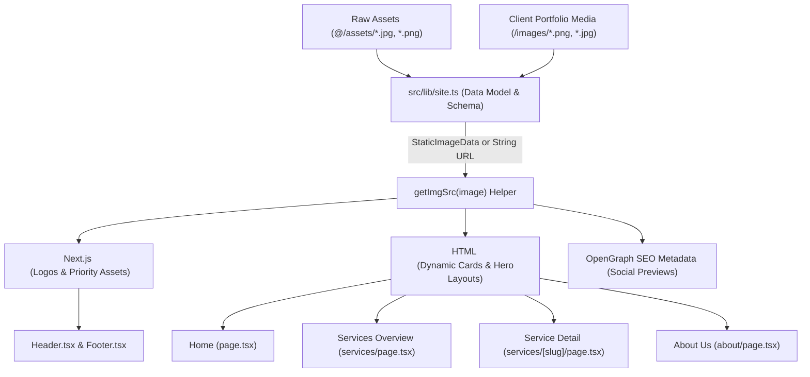

# neXsign Project Image Architecture & Usage Documentation

This document provides a complete technical audit of all images used across the **neXsign** project codebase. It explains **where**, **why**, and **how** images are used, the **linking concept & architecture**, and how the newly analyzed `/images` repository connects to the application.

---

## 1. 🏗️ Image Architecture & Linking Concept

The neXsign project utilizes a centralized data-driven image pipeline built on **Next.js 15 App Router** and **TypeScript**.



### Key Technical Concepts:

1. **Static Import Bundling (`@/assets/...`)**:
   High-frequency static assets (brand logos, hero textures, default service thumbnails) are imported directly in TypeScript files. Next.js processes these into `StaticImageData` objects containing image metadata (width, height, blurDataURL, and hashed asset path).

2. **Unified Type System (`StaticImageData | string`)**:
   In [`src/lib/site.ts`](file:///f:/Delchemy/Projects/nexsign-luv/nexsign2/src/lib/site.ts), the `Service` type handles both build-time imported images and public URL string paths:

   ```typescript
   export type Service = {
     slug: string;
     title: string;
     short: string;
     image: string | StaticImageData;
     intro: string;
     body: string[];
     applications: string[];
   };
   ```

3. **Normalization Helper (`getImgSrc`)**:
   To allow components to consume both static imports and standard string paths without broken image references, the helper function extracts the string URL cleanly:

   ```typescript
   export const getImgSrc = (image: string | StaticImageData): string => {
     return typeof image === "string" ? image : image.src;
   };
   ```

4. **SEO & OpenGraph Integration**:
   Dynamic pages (such as `/services/[slug]` and `/about`) pass `getImgSrc(service.image)` directly into `metadata.openGraph.images` to generate rich social media preview cards when links are shared on LinkedIn, WhatsApp, or Twitter.

---

## 2. 📁 Active Project Image Inventory (`src/assets` & `public`)

Below is the complete inventory of all active images currently integrated into the user interface:

| #   | Asset File                          | File Location                                                            | Used In Component / Page                                                                                 | Purpose & Usage Rationale                                                                                                                                                  |
| --- | ----------------------------------- | ------------------------------------------------------------------------ | -------------------------------------------------------------------------------------------------------- | -------------------------------------------------------------------------------------------------------------------------------------------------------------------------- |
| 1   | **`nexsign-logo.png`**              | `@/assets/nexsign-logo.png`<br>`public/nexsign-logo.png`                 | [`Header.tsx`](file:///f:/Delchemy/Projects/nexsign-luv/nexsign2/src/components/site/Header.tsx#L41-L47) | **Primary Brand Header Logo**: Mounted in the sticky top navigation header across all pages with `priority` loading.                                                       |
| 2   | **`nexsign-footer-logo2.png`**      | `@/assets/nexsign-footer-logo2.png`<br>`public/nexsign-footer-logo2.png` | [`Footer.tsx`](file:///f:/Delchemy/Projects/nexsign-luv/nexsign2/src/components/site/Footer.tsx#L12)     | **Dark Mode Footer Logo**: High-contrast white/brand logo variant optimized for the dark footer (`bg-ink`).                                                                |
| 3   | **`hero-workshop.jpg`**             | `@/assets/hero-workshop.jpg`                                             | [`app/page.tsx`](file:///f:/Delchemy/Projects/nexsign-luv/nexsign2/src/app/page.tsx#L58-L65)             | **Home Hero & About Section Background**: Immersive background texture showing 3D metal signage fabrication with dark gradient overlays (`from-ink via-ink/85 to-ink/40`). |
| 4   | **`about-workshop.jpg`**            | `@/assets/about-workshop.jpg`                                            | [`app/about/page.tsx`](file:///f:/Delchemy/Projects/nexsign-luv/nexsign2/src/app/about/page.tsx#L38-L47) | **About Us Story Feature & OG Image**: Visual anchor for "Our Story" showing craftsman activity inside the Mussafah workshop.                                              |
| 5   | **`service-exterior.jpg`**          | `@/assets/service-exterior.jpg`                                          | [`lib/site.ts`](file:///f:/Delchemy/Projects/nexsign-luv/nexsign2/src/lib/site.ts#L53-L56)               | **Exterior Signage Thumbnail**: Card preview image on Home page, `/services`, and `/services/exterior-signage`.                                                            |
| 6   | **`service-interior.jpg`**          | `@/assets/service-interior.jpg`                                          | [`lib/site.ts`](file:///f:/Delchemy/Projects/nexsign-luv/nexsign2/src/lib/site.ts#L76)                   | **Interior Signage Thumbnail**: Card preview image on Home page, `/services`, and `/services/interior-signage`.                                                            |
| 7   | **`service-pylon.jpg`**             | `@/assets/service-pylon.jpg`                                             | [`lib/site.ts`](file:///f:/Delchemy/Projects/nexsign-luv/nexsign2/src/lib/site.ts#L96)                   | **Pylon Signs Thumbnail**: Card preview image on Home page, `/services`, and `/services/pylon-signs`.                                                                      |
| 8   | **`service-vehicle.jpg`**           | `@/assets/service-vehicle.jpg`                                           | [`lib/site.ts`](file:///f:/Delchemy/Projects/nexsign-luv/nexsign2/src/lib/site.ts#L116)                  | **Vehicle Graphics Thumbnail**: Card preview image on Home page, `/services`, and `/services/vehicle-graphics`.                                                            |
| 9   | **`service-hoarding.jpg`**          | `@/assets/service-hoarding.jpg`                                          | [`lib/site.ts`](file:///f:/Delchemy/Projects/nexsign-luv/nexsign2/src/lib/site.ts#L135)                  | **Hoarding & Banners Thumbnail**: Card preview image on Home page, `/services`, and `/services/hoarding-and-banners`.                                                      |
| 10  | **`service-etching.jpg`**           | `@/assets/service-etching.jpg`                                           | [`lib/site.ts`](file:///f:/Delchemy/Projects/nexsign-luv/nexsign2/src/lib/site.ts#L154)                  | **Etching & Engraving Thumbnail**: Card preview image on Home page, `/services`, and `/services/etching-and-engraving`.                                                    |
| 11  | **`service-traffic.jpg`**           | `@/assets/service-traffic.jpg`                                           | [`lib/site.ts`](file:///f:/Delchemy/Projects/nexsign-luv/nexsign2/src/lib/site.ts#L173)                  | **Traffic Signs Thumbnail**: Card preview image on Home page, `/services`, and `/services/traffic-signs`.                                                                  |
| 12  | **`service-safety.jpg`**            | `@/assets/service-safety.jpg`                                            | [`lib/site.ts`](file:///f:/Delchemy/Projects/nexsign-luv/nexsign2/src/lib/site.ts#L193)                  | **Safety Signs Thumbnail**: Card preview image on Home page, `/services`, and `/services/safety-signs`.                                                                    |
| 13  | **`titlelogo.png` & `favicon.ico`** | `public/favicon.ico`<br>`src/app/icon.png`                               | [`app/layout.tsx`](file:///f:/Delchemy/Projects/nexsign-luv/nexsign2/src/app/layout.tsx)                 | **Favicon & Browser Icon**: Displayed in browser tabs, search results, and mobile shortcuts.                                                                               |

---

## 3. 🔗 Connection to the Media Repository (`/images` — 41 Files)

While `src/assets` currently supplies 12 core static thumbnails and logos, the **`/images`** directory contains 41 real-world client project photos (such as _Danat Al Emarat Hospital_, _Choithrams fleet_, _Unilever_, _Ateeq Ur Rahman_, _Al Mariah St._, etc.).

### Integration Opportunities:

1. **Direct Substitution in `src/lib/site.ts`**:
   Because `getImgSrc()` accepts relative public string paths (e.g., `"/images/imgi_45_1ae8a2adf67f5c20c5ccf01aa4241830.png"`), service objects in `src/lib/site.ts` can immediately link to real client photos without modifying component logic.

2. **Service Detail Image Galleries (`/services/[slug]`)**:
   Extend `Service` schema with an `gallery?: string[]` array to display multi-photo carousels or grids on each service detail page.

3. **Client Case Studies (`/clients`)**:
   Link client names (e.g., _ADNOC_, _LuLu_, _Cleveland Clinic_) to real project delivery photos from `/images`.
